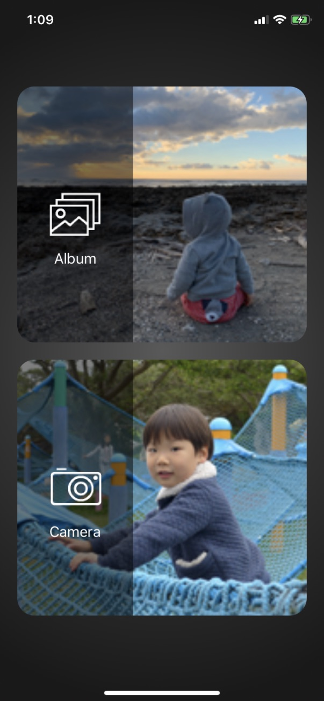
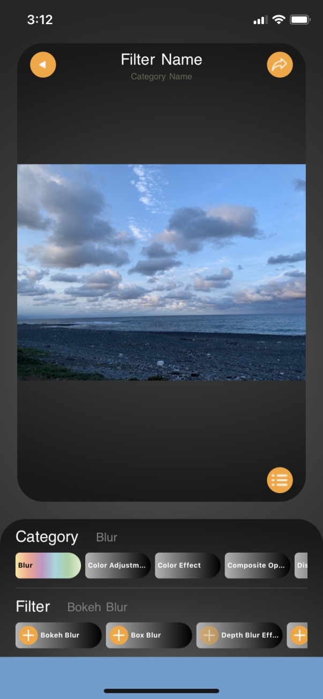
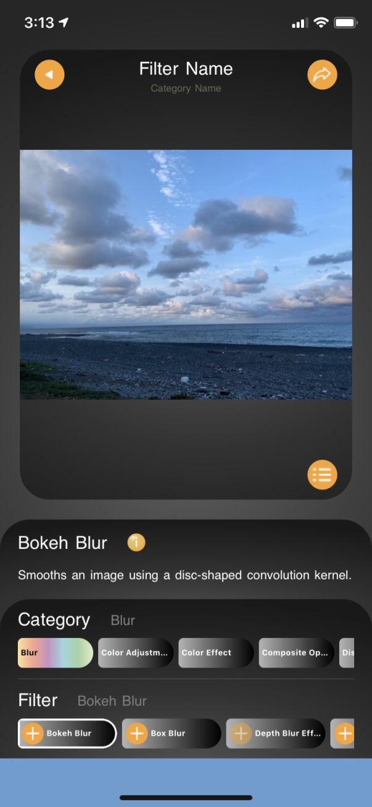
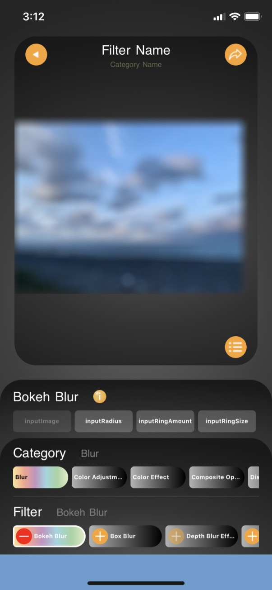
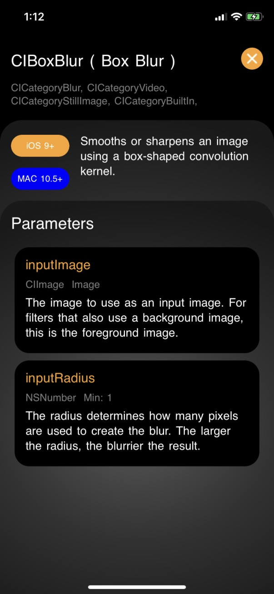
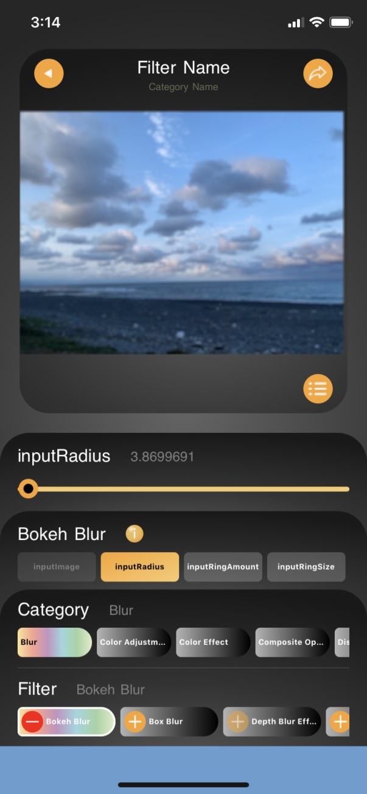
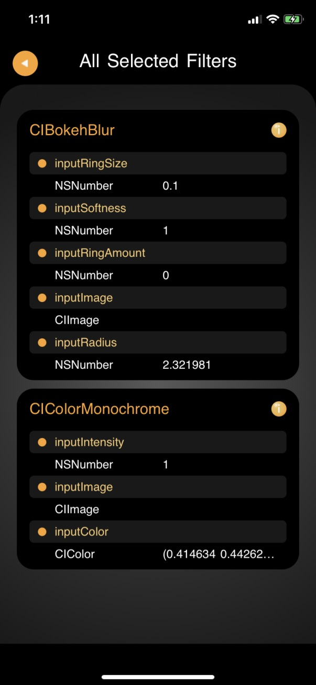

# MyEasyFilter
### MyEasyFilter是一款可以將Swift內建的CIFilter，透過可簡單操作的介面，調整參數並即時顯示濾鏡效果。可對同一張圖片添加1種以上的濾鏡，並列出所有已選濾鏡的參數值，以方便程式設計師測將調整好的參數套用至自己的App當中。

##### A simple app that can easy apply Core Image Filters on your photo and can easy adjust filter parameters

### APP功能說明：
* 選擇使用相簿照片，或使用相機拍照，濾鏡將會套用在所選擇的圖片上
  
  
* 選擇濾鏡分類

  
* 選擇分類下的濾鏡，彈出濾鏡說明
  
  
* 點選加入按鈕，濾鏡會即時套用至圖片上，並列出可調整參數
  
  
* 點選info按鈕，可查看濾鏡詳細資訊
  
  
* 選擇濾鏡參數作個別調整
  
  
* 點選已選濾鏡列表按鈕，查看目前所選濾鏡之參數值
  
  

### 未來預定新增功能
* 已選濾鏡列表新增濾鏡開關及刪除濾鏡按鈕
* 調整CIColor的介面更改為ColorPicker的方式
* 中文化及多國語
* 內建多種合成濾鏡效果
* 自訂濾鏡效果儲存
* 調整後圖片的儲存與發佈
* 查看CIFilter程式語法
* 廣告嵌入，收費版及免費版
* multi input image

### 以下列出部分濾鏡效果

### Swift Core Image 濾鏡分類
以效果分類可以分為14種

* **kCICategoryBlur**：模糊；如散景模糊、方塊模糊、深度模糊效果、光盤模糊、高斯模糊、蒙版可變模糊、中值過濾器、形態梯度、最大形態、最小形態、
形態矩形最大、形態矩形最小、運動模糊、降噪、變焦模糊

* **CICategoryColorAdjustment**：色彩調整；如彩色夾、色彩控制、顏色矩陣、顏色多項式、深度差距、深度差異、曝光調整、伽瑪調整、色相調整、
線性到SRGB色調曲線、SRGB色調曲線線性、溫度和色調、色調曲線、充滿活力、白點調整

* **CICategoryColorEffect**：色彩效果；如彩色叉多項式、彩色立方體、顏色立方體與色彩空間、彩色立方體與面膜混合、顏色曲線、色彩反轉、色彩圖、
彩色單色、彩色海報、顫動、文件增強器、假色、實驗室三角洲E、面具到阿爾法、最大分量、最小成分、調色板質心、貨盤化、照片效果Chrome、照片效果淡入淡出、
照片效果瞬發、照片效果單聲道、照片效果黑色、照片效果處理、照片效果色調、照片效果轉移、棕褐色調、熱的、小插圖、小插圖效果、X射線

* **CICategoryCompositeOperation**：複合操作；如加法合成、色彩混合模式、混色混合模式、道奇混合模式、調暗混合模式、差異混合模式、分割混合模式、
排除混合模式、硬光混合模式、色相混合模式、減輕混合模式、線性刻錄混合模式、線性減淡混合模式、亮度混合模式、最大合成、最小合成、乘法混合模式、
乘法合成、疊加混合模式、針光混合模式、飽和混合模式、屏幕混合模式、柔光混合模式、源代碼合成、合成中的來源、源出合成、合成源、減混合模式

* **CICategoryDistortionEffect**：扭曲效果；如凹凸變形、凹凸變形線性、相機校準鏡頭校正、圓飛濺變形、圓形包裝、位移變形、德羅斯特、玻璃變形、
玻璃錠劑、孔變形、輕型隧道、九部分拉伸、九部分平鋪、捏變形、拉伸作物、環面畸變、扭曲變形、渦旋畸變

* **CICategoryGenerator**：影像生成器；如屬性文本圖像生成器、阿茲台克代碼生成器、條碼生成器、棋盤生成器、Code128條碼生成器、恆定顏色發生器、
透鏡光暈發生器、網格生成器、PDF417條碼生成器、QRCode生成器、隨機發生器、星光發生器、條紋生成器、陽光發生器、文字圖像生成器

* **CICategoryGeometryAdjustment**：幾何調整；如仿射變換、雙三次尺度變換、裁切、邊緣保留上採樣濾鏡、Lanczos比例變換、透視校正、透視變換、
具有範圍的透視變換、拉直過濾器

* **CICategoryGradient**：漸變；如高斯梯度、色相飽和度值梯度、線性漸變、徑向漸變、平滑線性漸變

* **CICategoryHalftoneEffect**：半色調效果；如CMYK半色調、圓網、點屏、陰影線、線屏

* **CICategoryReduction**：減少；如平均面積、面積直方圖、最大面積、面積最大Alpha、面積最小最大、面積最小最大紅色、最小面積、面積最小阿爾法、
列平均值、直方圖顯示過濾器、均值、行平均

* **CICategorySharpen**：銳化；如增強亮度、銳化蒙版

* **CICategoryStylize**：風格化；如與Alpha面膜混合、融合藍色面膜、融合面膜、融合紅色面膜、盛開、漫畫效果、卷積3X3、卷積5X5、卷積7X7、
卷積9水平、卷積9垂直、核心ML模型篩選器、結晶、景深、邊緣工作、邊緣、愁雲、遮罩的高度場、六角像素、HighlightS hadow Adjust、線重疊、
混合、像素化、點化、顯著性地圖過濾器、最近樣本、陰影材質、專色、射燈

* **CICategoryTileEffect**：平鋪效果；如仿射夾、仿射磚、鉗、八折反射磚、四重反射磚、四重旋轉瓷磚、四折平鋪、滑行反射磚、萬花筒、歐普瓷磚、
平行四邊形圖塊、透視瓷磚、六折反射磚、六重旋轉瓷磚、三角萬花筒、三角瓦、十二折反射磚、

* **CICategoryTransition**：過渡效過：如手風琴折疊過渡、條形滑動過渡、複印機過渡、通過遮罩過渡分解、消除過渡、閃光過渡、Mod過渡、頁面捲曲過渡、
帶有陰影過渡的頁面捲曲、波紋過渡、滑動過渡

#### 若按使用場景分類，可分為5類:
* **kCICategoryStillImage**：用於靜態影象
* **kCICategoryVideo**：用於視訊
* **kCICategoryInterlaced**：用於交錯影象
* **kCICategoryNonSquarePixels**：用於非矩形畫素
* **kCICategoryHighDynamicRange**：用於HDR

